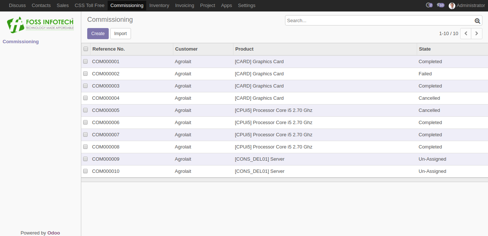
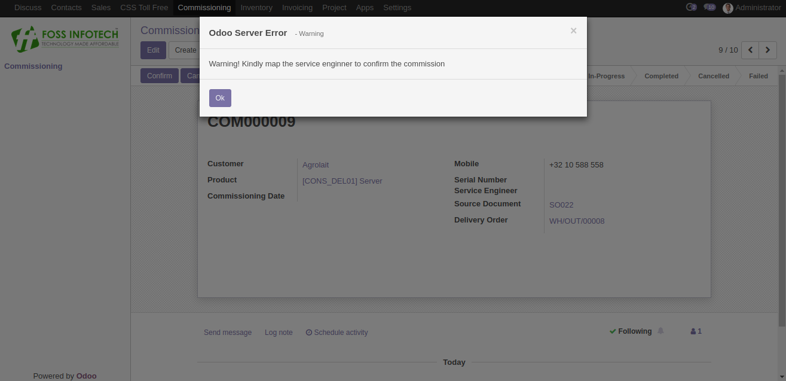
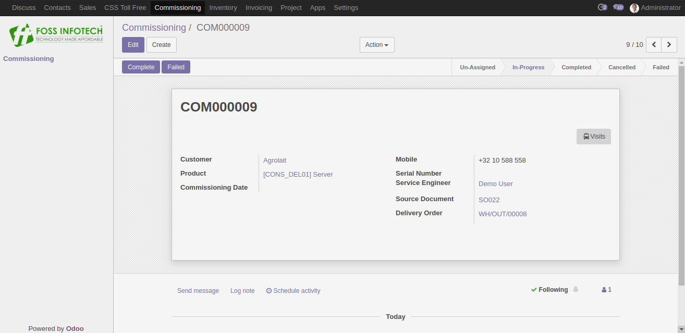

Author : FOSS INFOTECH PVT LTD

Module : commissioning\_crm

Version : 11.0

<h2>After Sales Commissioning</h2>

Commissioning module for Odoo 11. This module allows you to define service engineers to their commissions and generates visits for the respective commissions.

<b>Step 1</b>: Define the commissionable products by clicking on the field 'Can be Commissioned' in the Product variants.

<b>Step 2</b>: Map your stages with the field 'Related Status'.

<b>Step 3</b>:Once the Delivery Order has been validated, Commissioning will be created for each done quantity.

<b>Step 4</b>:Two commissions have been generated for two done quantities.

<b>Step 5</b>:Before the Confirmation of the commissioning, Assign a service engineer.

<b>Step 6</b>:On confirmation of the commissioning, A task (or) visit will be created. By clicking on the 'Visits' Button.  You can easily track the visit and you may also create multiple visits for a commissioning.

<b>Step 7</b>:A Generated Visit.
  

<b>Step 8</b>: On Completion of the Commissioning, A mail notification will be sent to the service enginner.
  

