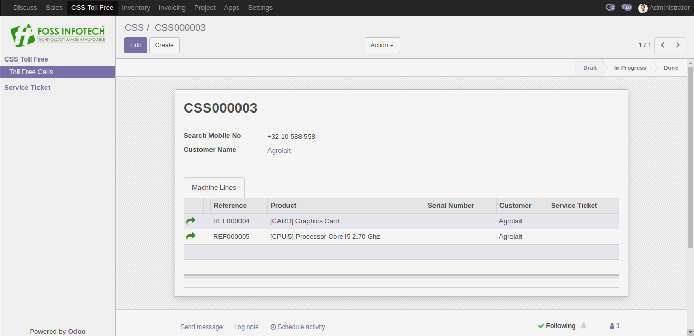
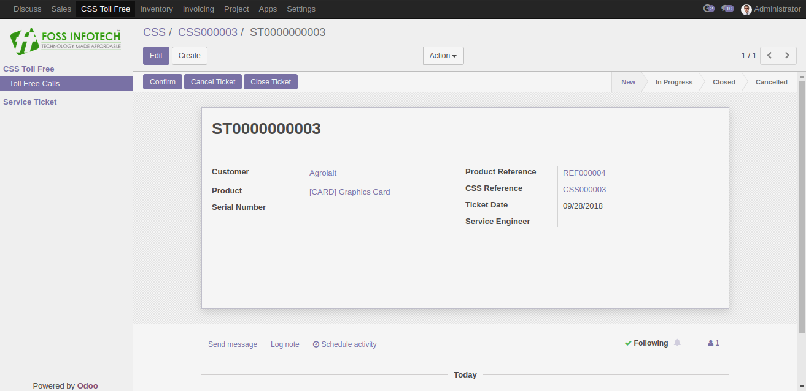
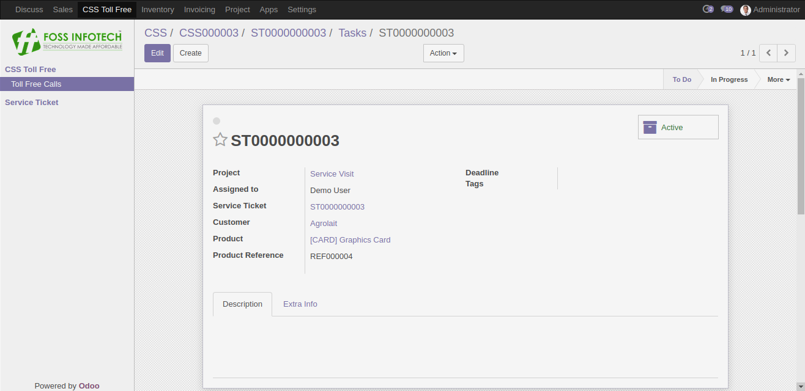
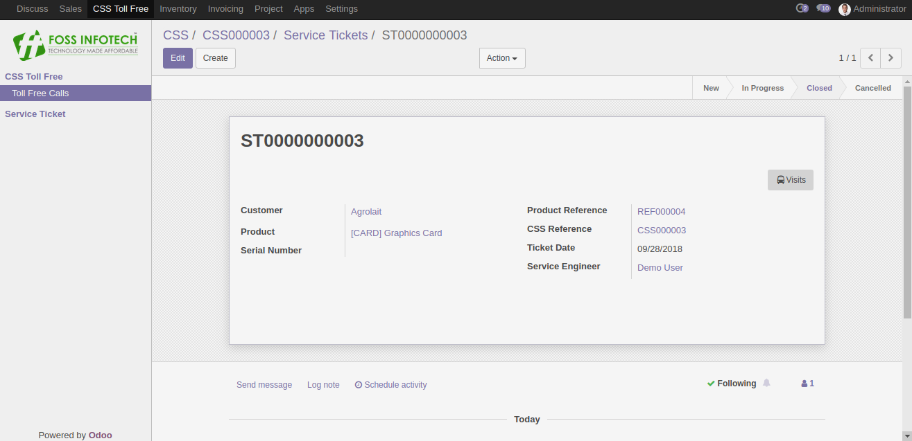

Author : FOSS INFOTECH PVT LTD

Module : css\_support

Version : 11.0

<h2>CSS Support</h2>

CSS Support module for Odoo 11. This module fetches products from the Delivery Order for a particular customer using their mobile number or by their name. It helps create service tickets for each products and you can assign respective service enginners.

<b>Step 1</b>: Enter the Phone number of the customer if not just by choosing the name of the customer. It fetches the products from the Delivery Order. You can create service ticket for the required product by clicking on the button 'Create Service Ticket'.

<b>Step 2</b>:  A service ticket yet to be confirmed.

<b>Step 3</b>:Assign the Service Enginner and confirm the service visit.

<b>Step 4</b>:A visit or a task will be generated on confirmation of the service ticket.

<b>Step 5</b>:You may close the service ticket once the visit has been completed. A mail notification will be sent to the service enginner once the service ticket has been closed.

