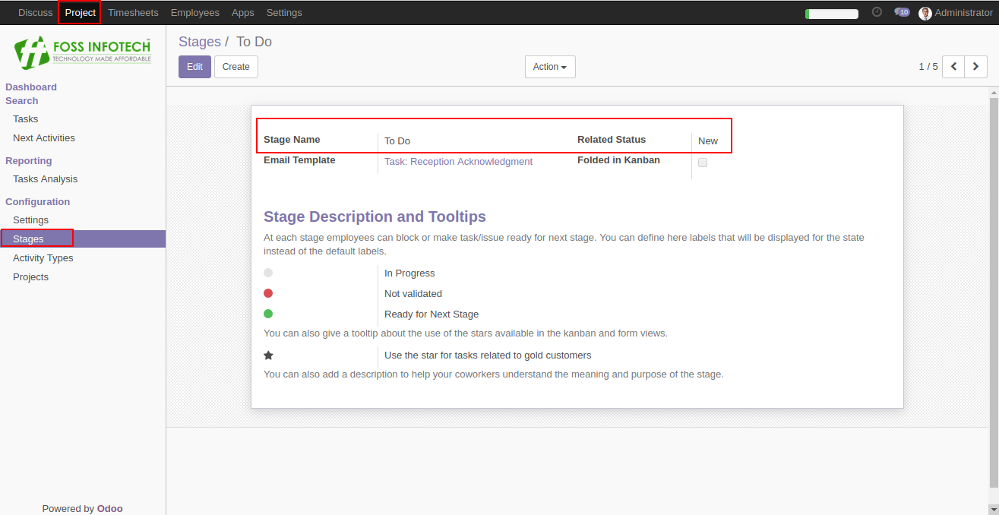
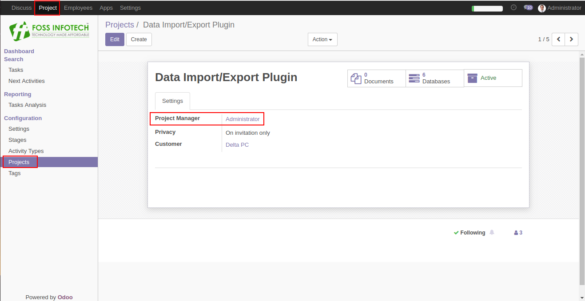

Author : FOSS INFOTECH PVT LTD

Module : escalation\_mail

Version : 11.0

<h2>Escalation Mail on status of the task</h2>

This Module sends notifications or Escalation Emails to the Respective Project Managers on regular basis on the status of the task when the task is in TO-Do or in In-Progress state and has reached it's deadline.

<b>Step 1</b>:Map your stages with the field 'Related Status'.

<b>Step 1</b>: Assign Project managers to the project.

<b>Step 2</b>: When the task has reached it's deadline, The respective project managers will receive Email notifications on regular basis for every delayed task until the task moves into the done state.
 

