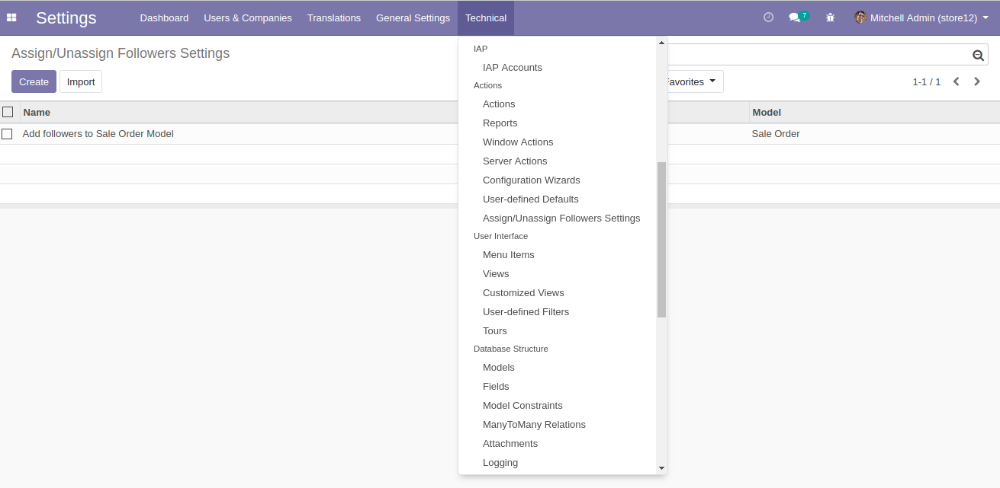
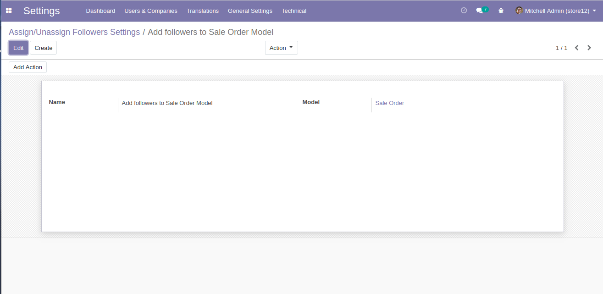
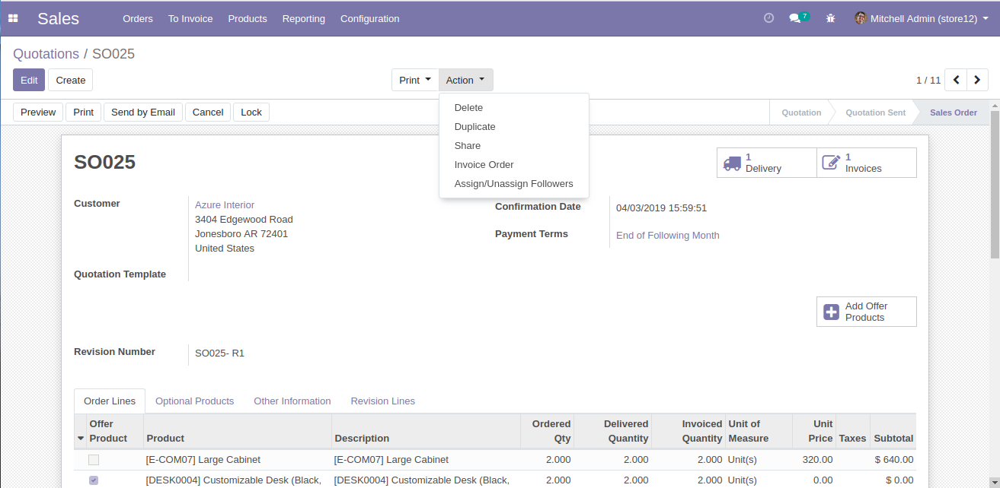
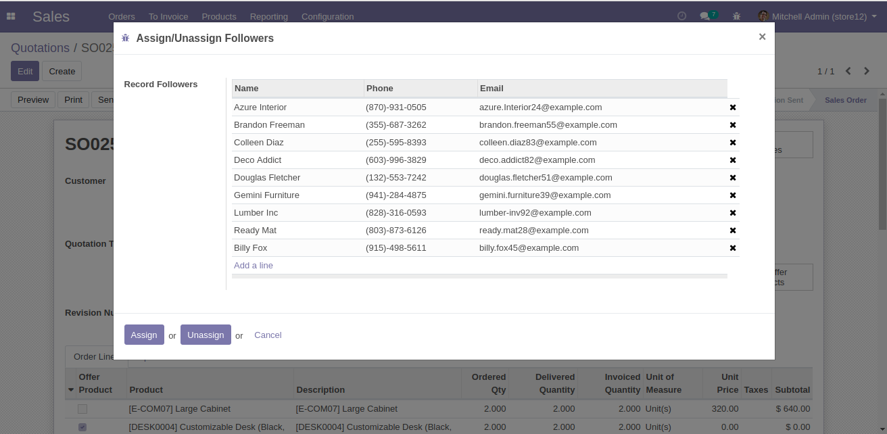
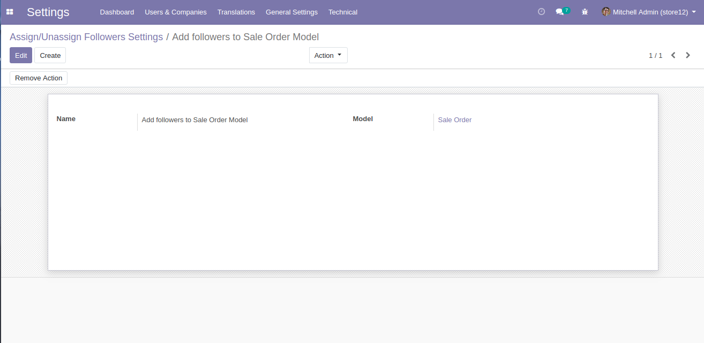

Author : FOSS INFOTECH PVT LTD

Module : foss\_assign\_unassign

Version : 13

<h2>Assign and Unassign Followers</h2>

This application helps you add followers to a particular model and to a particular record with simple configuration.

<b>Step 1</b>:To find the menu, Activate the developer's mode and go to Technical --> Actions --> Assign/Unassign Followers settings.

<b>Step 2</b>:To activate assign followers feature, Give a name for reference, choose the model and click on 'Add Action'.

<b>Step 3</b>:After the button <b>'Add Action'</b> is clicked, You'll find a menu <b>'Assign/Unassign Followers'</b> under <b>Actions</b> in the model that you added for.

<b>Step 4</b>:Click on the menu, A wizard pops up where you can assign or unassign the followers.

<b>Step 4</b>:Followers have been assigned to the particular Sale Order.

<b>Step 4</b>:You can remove the action, By clicking on 'Remove Action' in the Assign/Unassign Followers Settings.

