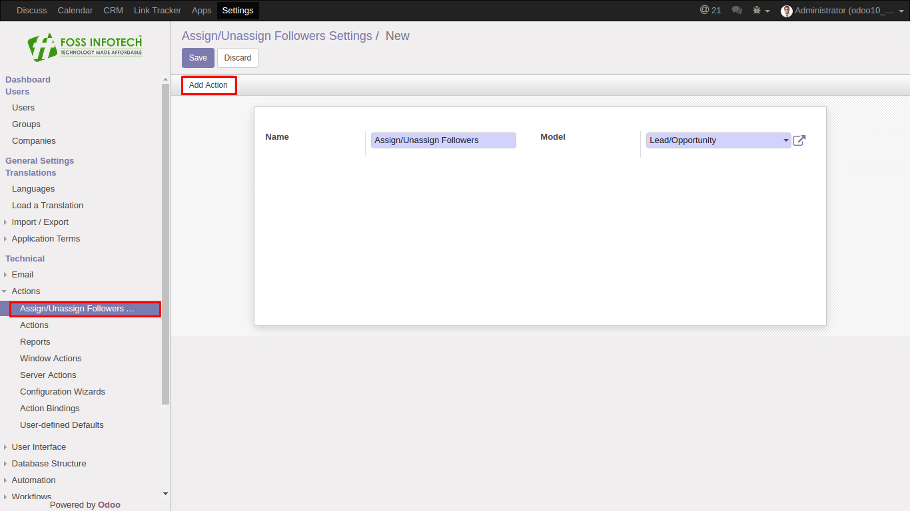
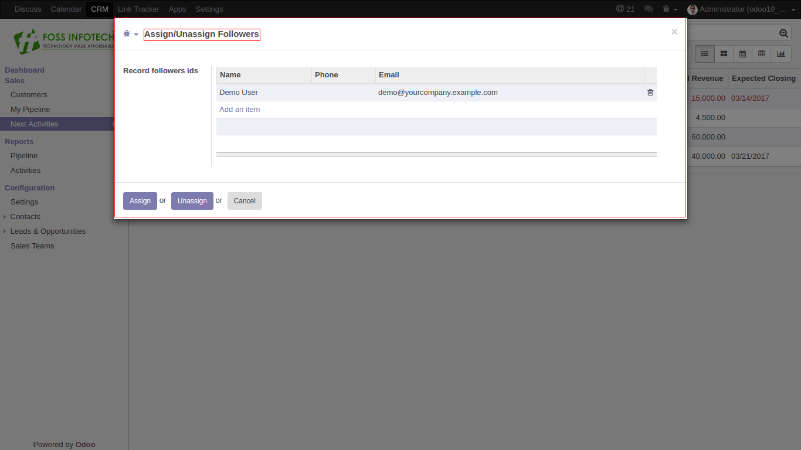
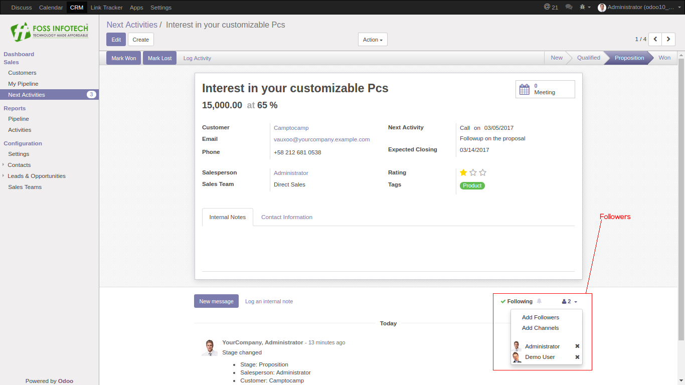

Author : FOSS INFOTECH PVT LTD

Module : foss\_assign\_unassign

Version : 10

<h2>Assign and Unassign Followers</h2>

Odoo assign followers module. By using this module, we can assign bulk number of followers
to a particular record or N number of records. We can assign multiple followers to multiple of records using wizard.

<h3>Assign followers to a Record of any Model</h3>

<b>Step 1</b>:  After installing the module go to Settings > Technical > Action > Assign followers

<b>Step 2</b>: Create a Model for assigning Followers to records with help of Name and choosing Model in the form. Save it and click “Add Action” button.

<b>Step 3</b>: It will shown in the Lead/Opportunity tree view more button. Now we can assign bulk number of followers to a particular record or N number of records.

<b>Step 4</b>: Now we can assign multiple followers to multiple of records using wizard.

