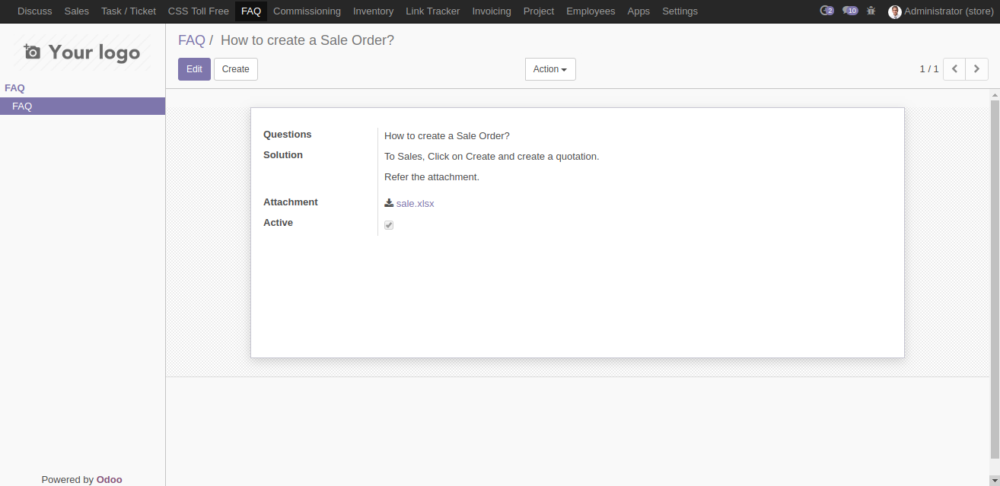

Author : FOSS INFOTECH PVT LTD

Module : foss\_faq

Version : 11.0

<h2>Frequently Asked Questions</h2>

Frequently Asked Questions - FAQ, module for Odoo 11. This module helps you create FAQs for the users reference and you may also add attachments.

<b>Step 1</b>: Click on create and add your FAQs. You also add attachments for reference.

