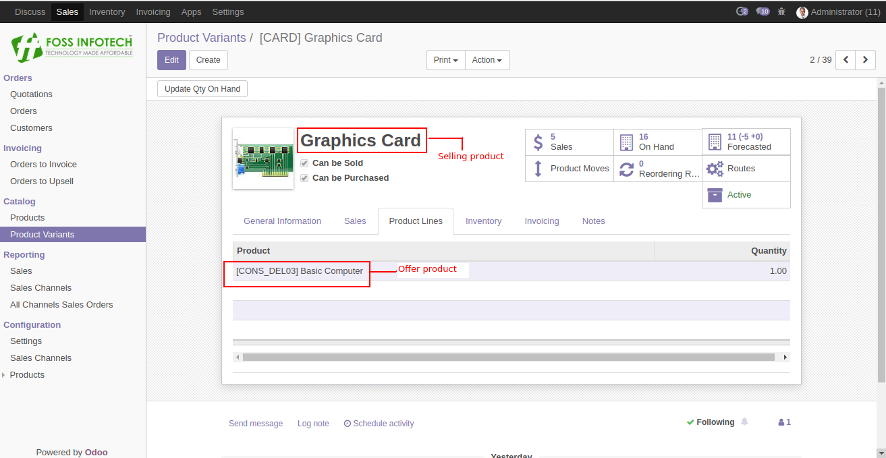
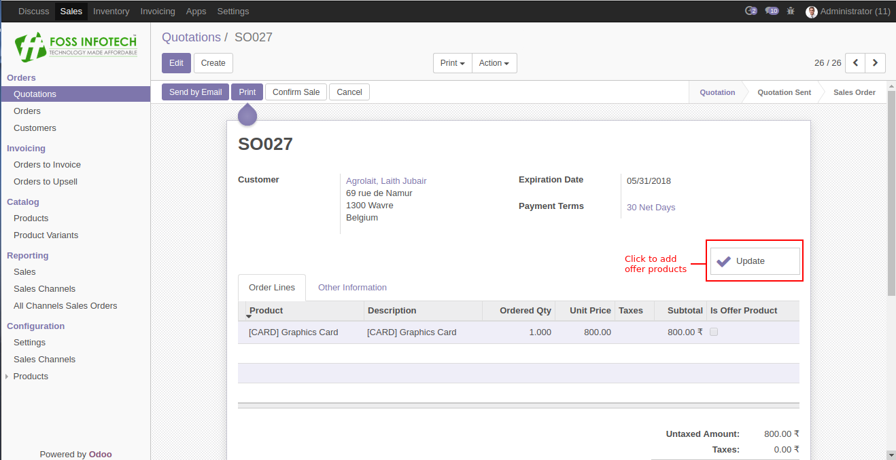
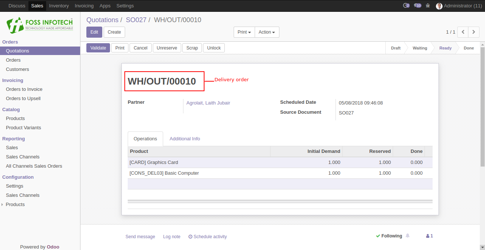
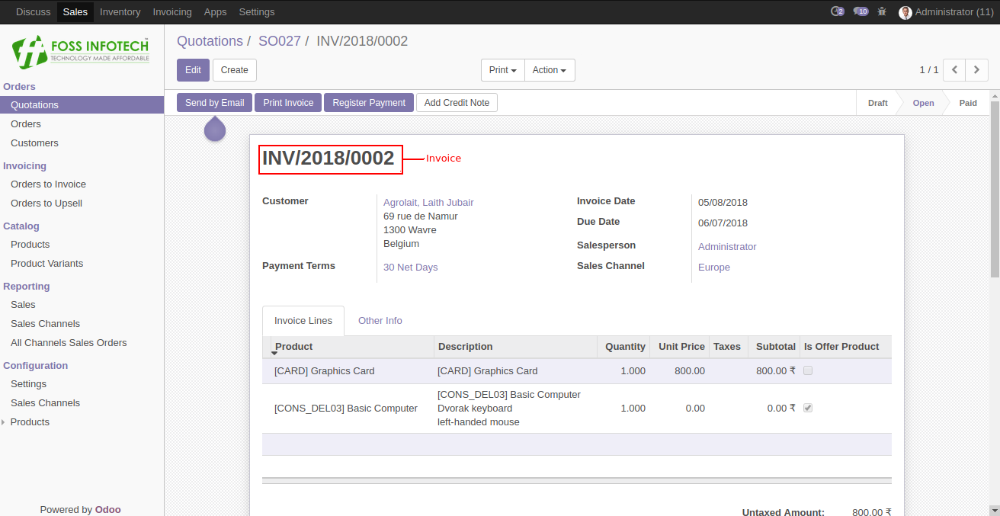

Author : FOSS INFOTECH PVT LTD

Module : foss\_product\_bundle

Version : 11

<h2>Product Bundle</h2>

Product Bundle module for Odoo 11. This modules helps you create a product bundle for the selling products as offer products.

<b>Step 1</b>:  In the product variants, choose a product and click on the product lines to add the offer products   for the selling product.

<b>Step 2</b>: Create a SO Quotation, and when the Update button is clicked the offer products   mapped with the selling product will be displayed on the order lines.

<b>Step 3</b>:The field 'Is offer product' indicates that the product is an offer product.
        

<b>Step 4</b>: Delivery order and invoice can be generated after confirming the sale order containing the offer products.

