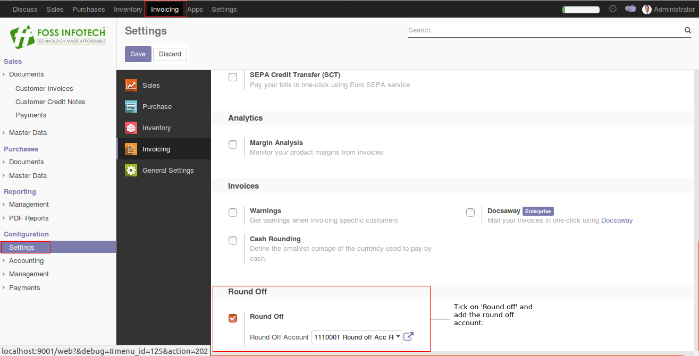
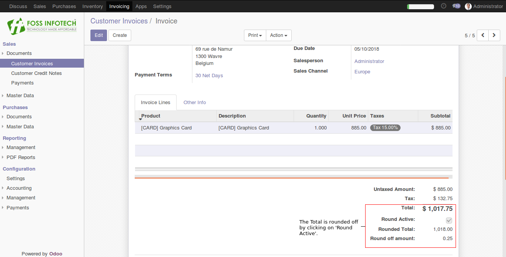
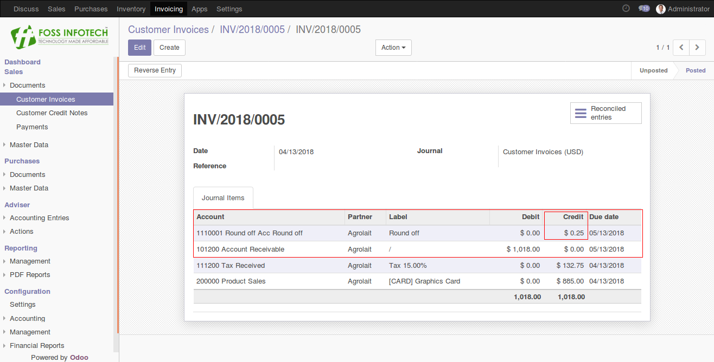

Author : FOSS INFOTECH PVT LTD

Module : foss\_Round\_off

Version : 11

<h2>Round off invoice amount</h2>

The Round off invoice amount module. Using this module, you can round off the invoice (decimal amount) to it's nearest whole amount for Customer Invoices and Vendor Bills.

<b>Step 1</b>:  Go to settings and tick on 'Round off' and add a Round off account.

<b>Step 2</b>: Create your invoice and tick on 'Round Active' to round off your total.

<b>Step 3</b>:Validate the invoice. 

<b>Step 4</b>: A journal entry is passed to balance the amount.  

