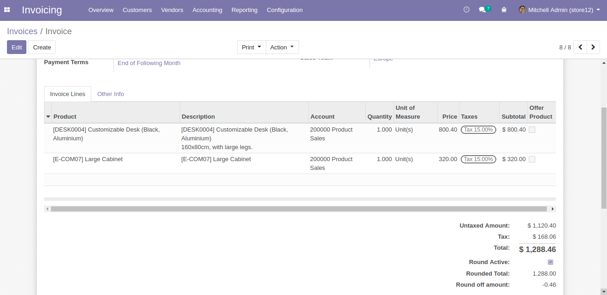
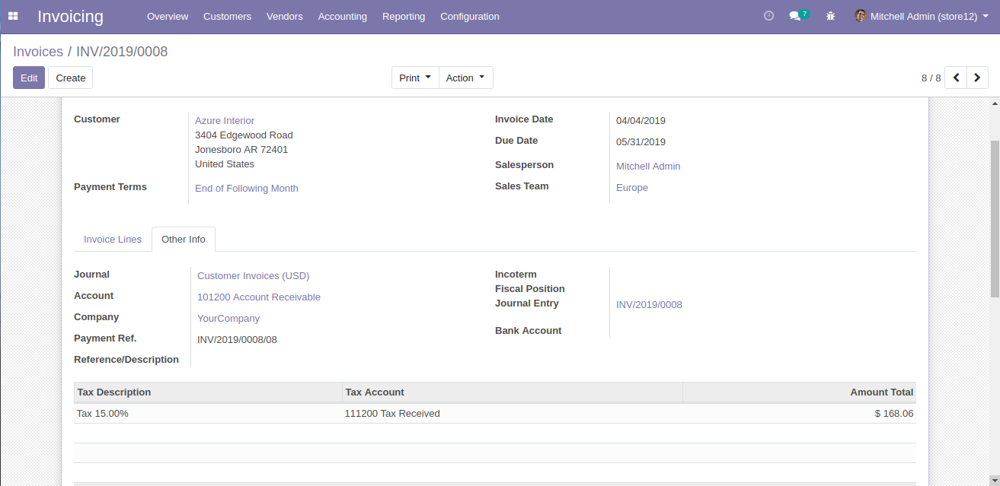
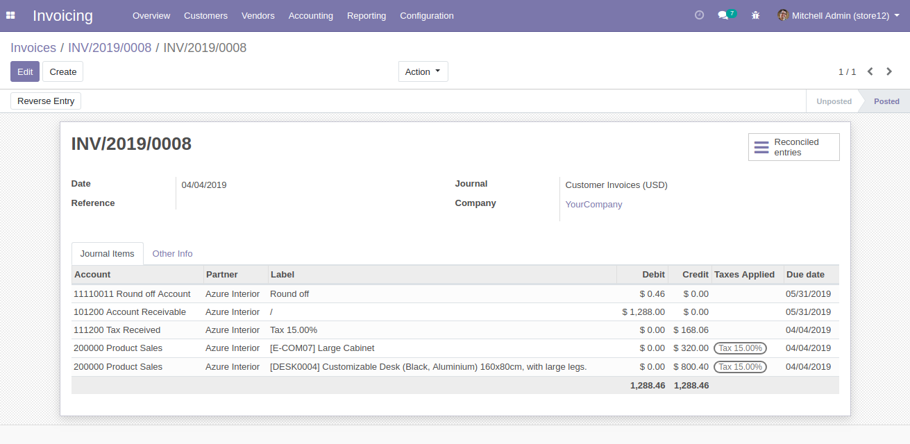

Author : FOSS INFOTECH PVT LTD

Module : foss\_Round\_off

Version : 12

<h2>Round off invoice amount</h2>

Using this module, you can round off the invoice (decimal amount) to it's nearest whole amount for Customer Invoices and Vendor Bills.

<b>Step 1</b>:Go to Settings --> General Settings and add an account for Round Off as depicted in the below image.

<b>Step 2</b>:If the check box <b>'Round Active'</b> is checked then the rounded off total will be displayed.

<b>Step 3</b>:Validate the Invoice and Click on the Journal entry.

<b>Step 4</b>:A Journal entry is passed to balance the amount.

