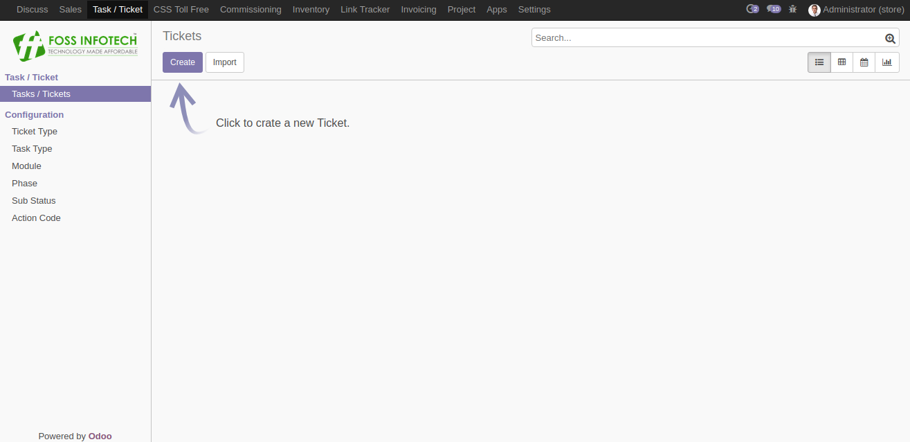
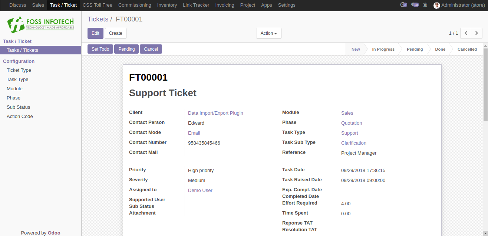
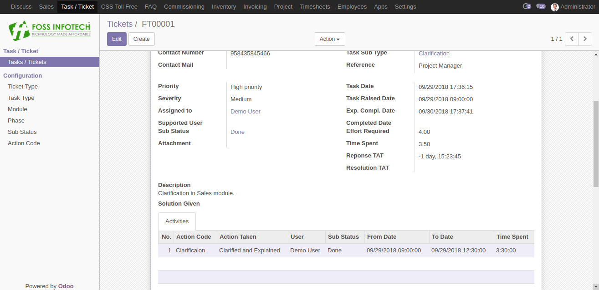
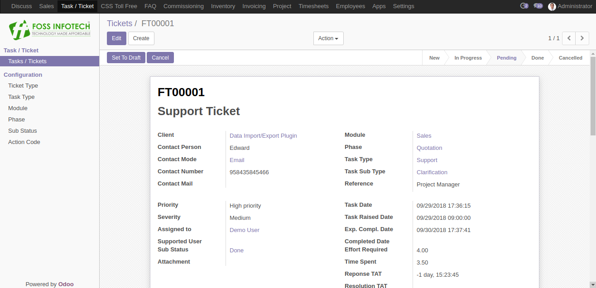
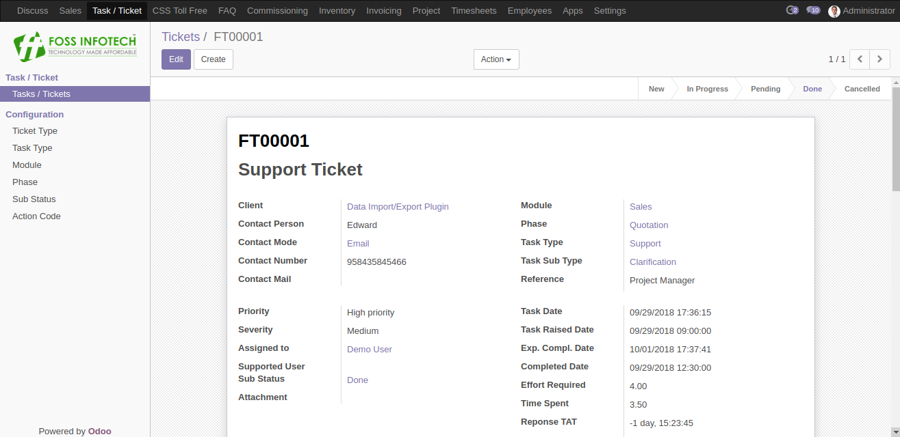

Author : FOSS INFOTECH PVT LTD

Module : foss\_support\_ticket

Version : 11.0

<h2>Support Ticket System</h2>

Support Ticket System keeps a track on the support activities assigned to the employees. 

<b>Step 1</b>:Configure all the master data.

<b>Step 2</b>:Create your Support Ticket. Fill all fields. Plan the hours required in the 'Effort Required' Field.

<b>Step 3</b>:Once the task has been started, Click on 'Set TODO'. You can find the state of the task being moved from 'New' to 'In-Progress'. You can update the actuals in the Timsheet.

<b>Step 4</b>:when the timesheets are updated, The actual time taken to complete the task will updated in the field 'Hours Spent'.

<b>Step 5</b>:You can put the task on pending, By clicking on the button 'Pending'.

<b>Step 6</b>:You can complete the task by entering the 'Completed date' and the 'Solution Given'.

