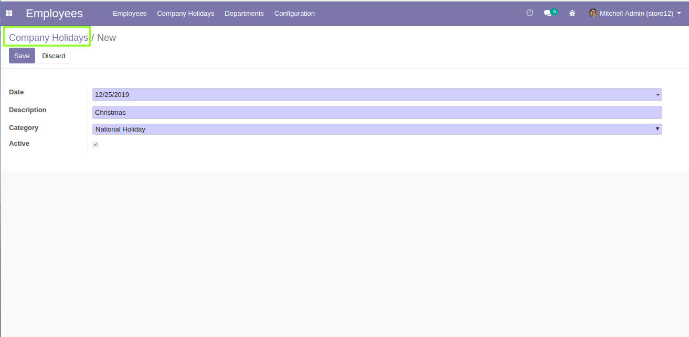
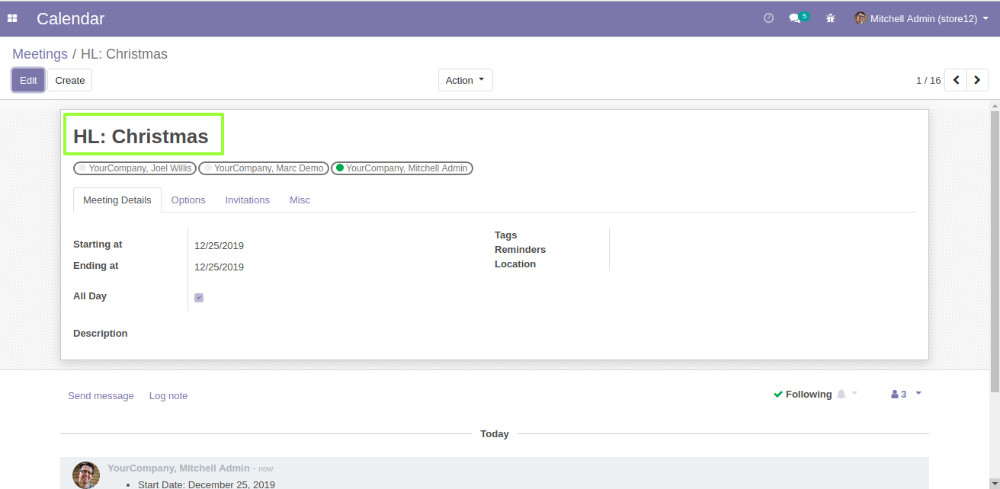

Author : FOSS INFOTECH PVT LTD

Module : HR\_company\_holidays

Version : 12

<h2>COMPANY HOLIDAY MANAGEMENT</h2>

 This Application helps you add your list of company holidays for your users reference, Also reflects in the calendar module so you can schedule your meetings accordingly.

<b>Step 1</b>:  Go to Employees --> Company Holidays to find the menu.

<b>Step 2</b>:Holiday Creation

<b>Step 3</b>:The Created Holiday reflecting in the calendar module.
 
<b>Calendar View</b>

<b>Step 4</b>:Form View
