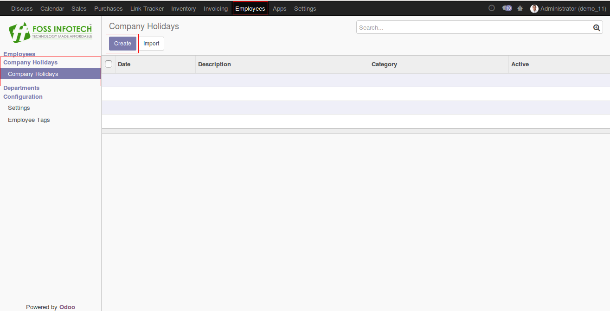
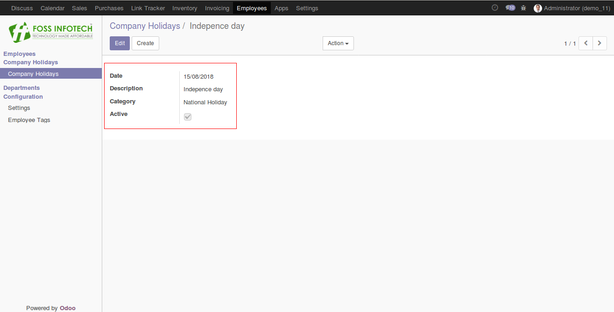
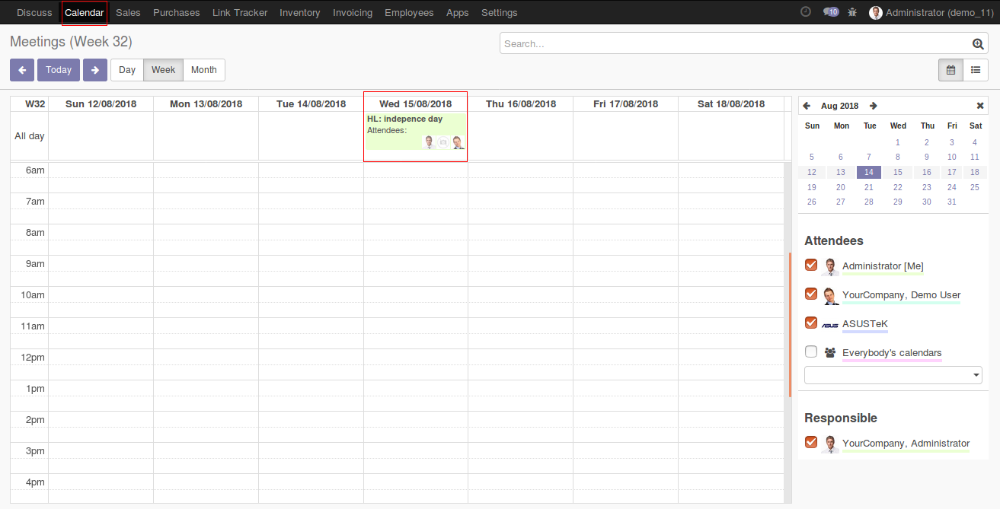

Author : FOSS INFOTECH PVT LTD

Module : HR\_company\_holidays

Version : 11

<h2>HR company holidays</h2>

 HR company holiday module for Odoo 11. This modules helps you create a list of company holidays.

<b>Step 1</b>:  Once the module is installed, Go to 'Employees'.

<b>Step 2</b>: Hit on the create button and create the holiday.

<b>Step 3</b>:Go to Calendar menu, Find the scheduled holiday reflecting now in the calendar.

