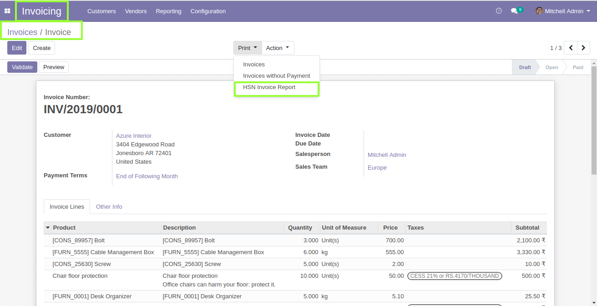
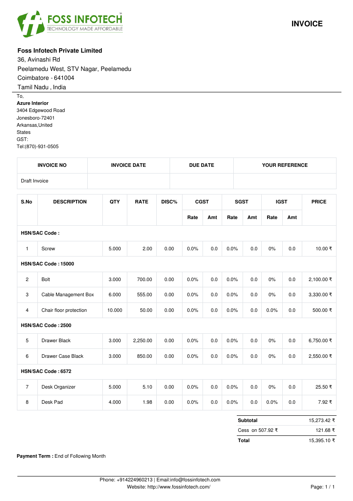
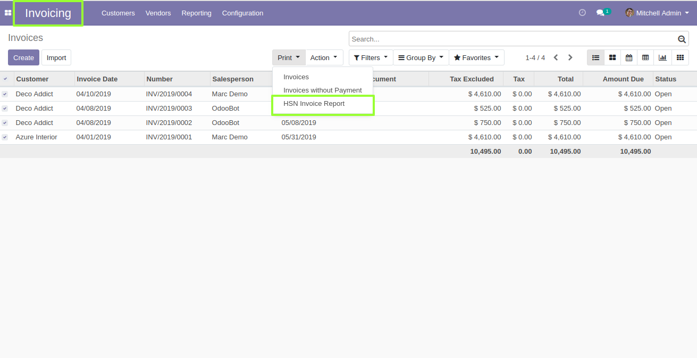

Author : FOSS INFOTECH PVT LTD

Module : hsn\_invoice\_report

Version : 12.0

<h2>HSN Invoice Report</h2>

The Module 'HSN Invoice Report' groups by Product HSN Code and prints a PFD Report.

<b>Step 1</b>:To generate HSN Invoice Report , Go to Customer Invoices or Vendor Bills --> Click on the required Invoice --> Print --> HSN Invoice Report.

<b>Step 2</b>:HSN based grouping of Products in Invoice Report is generated.

<b>Step 3</b>:Bulk HSN Reports can be generated in the list view, Go to Print --> HSN Invoice Report.

