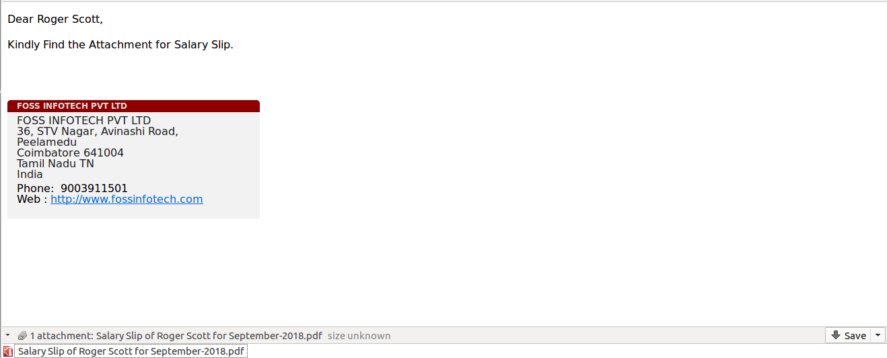

Author : FOSS INFOTECH PVT LTD

Module : payslip\_mass\_mailing

Version : 11

<h2>Payslip Mass Mailing</h2>

Payslip Mass Mailing module for Odoo 11. you can send selected and Confirmed payslips to respective employee by email.

<b>Step 1</b>:  Select the required payslips and click the Action menu - > Select Payslip Mass Mailing.

<b>Step 2</b>: Click on the 'Send Mail' button, to send the payslip to respective Employee by email.

<b>Step 3</b>: Recipients email is as follows.

<b>Step 4</b>: Find the attached Payslip.

