Author : FOSS INFOTECH PVT LTD

Module : Price\_History

Version : 11.0

<h2>Price History</h2>

ODOO 11 Module for Price History. The given module allows you to create a copy and store all line item from purchase quotation form to Purchase Revision Tab, which can be used for future comparision

<b>Step 1</b>: Create Purchase RFQ :

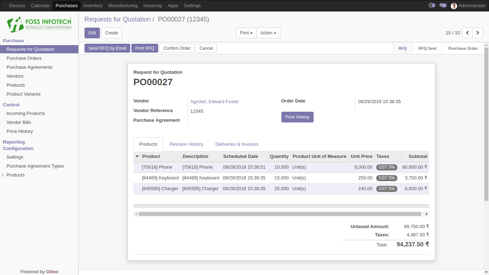

<b>Step 2</b>: Click on Price History button to create a copy of the products details that are present in RFQ :

<b>Step 3</b>: After getting the copy of product details in Revision History, we can also update RFQ :

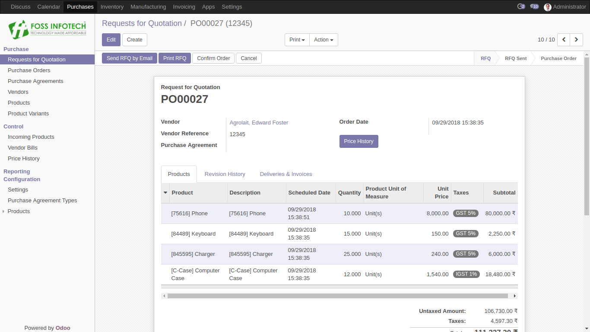

<b>Step 4</b>: Now by clicking on the Price History button, the updated product details of RFQ will be copied to Revision History :

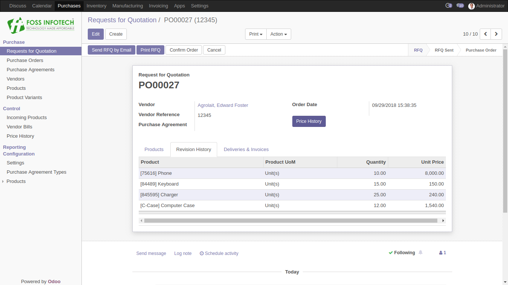

<b>Step 5</b>: Once after the confirmation of RFQ, Purchase Order will be created and Price History Button will become invisible :

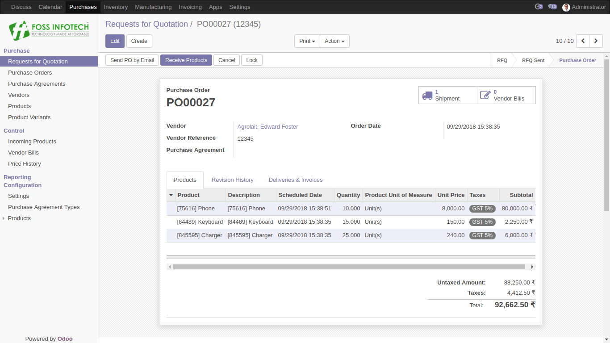

<b>Step 6</b>: Create Purchase Agreements :

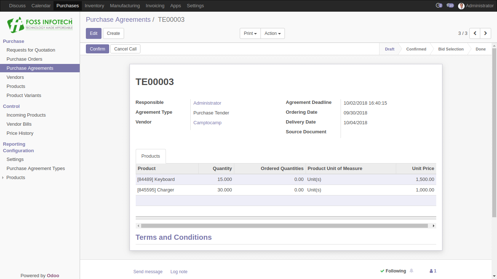

<b>Step 7</b>: Confirm the Purchase Agreements to create the RFQ for multiple vendors :
  
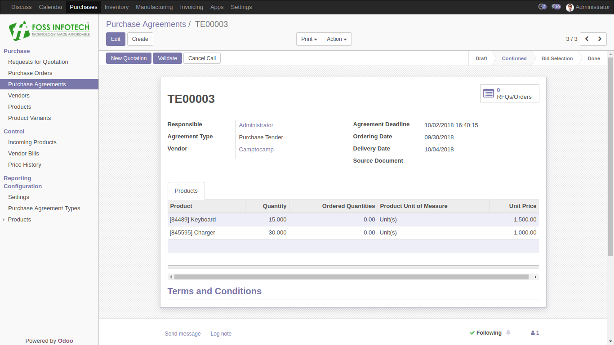

<b>Step 8</b>: Create Purchase RFQ :
  
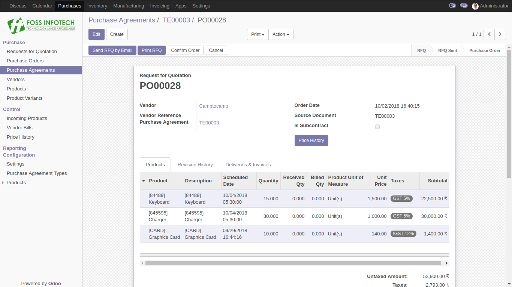

<b>Step 9</b>: Click on Price History button to create a copy of the products details that are present in RFQ :
  
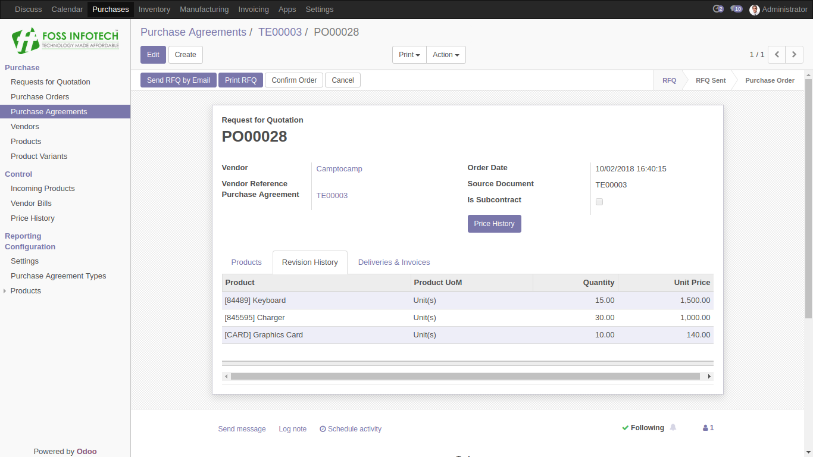

<b>Step 10</b>: Confirm the RFQ to create the Purchase Order and to make the Price History button invisible :
  
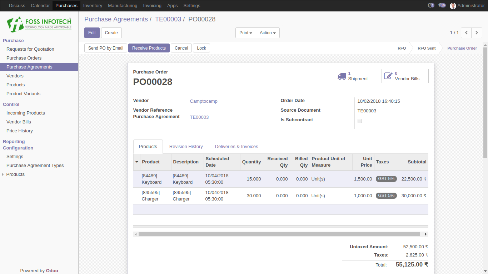

<b>Step 11</b>: Please find the Price History details in the Pivot Table based on RFQs and Purchase Agreements :
  
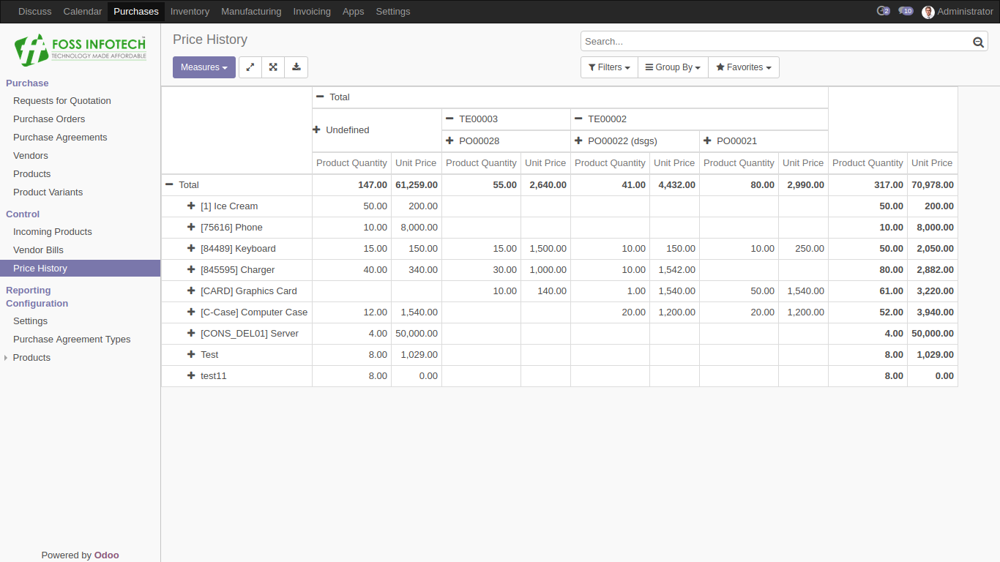

<b>Step 12</b>: Please find the Price History details in the Pivot Table based on Purchase Agreements and Vendors :
  
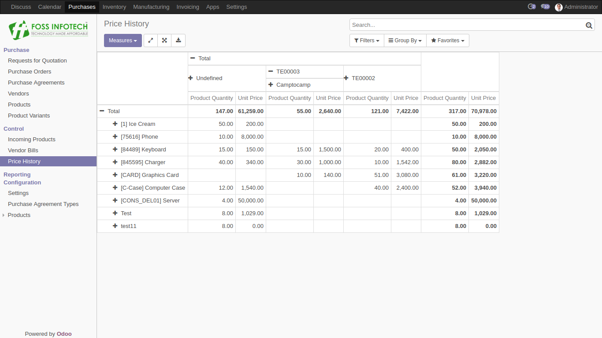
