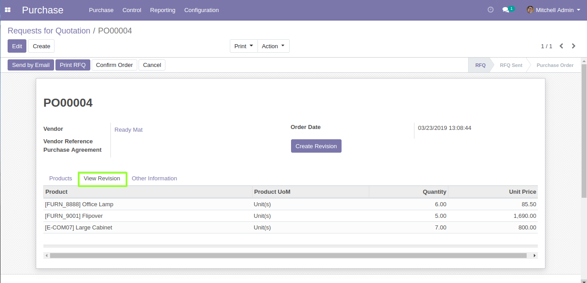

Author : FOSS INFOTECH PVT LTD

Module : Price\_History

Version : 12.0

<h2>Purchase Revision</h2>

This module stores up the previous quoted vaule on your RFQ, It can be used for future references.It's very simple to use with no configuration and also provides you a pivot view for analysis.

	<ul>
        <li>You'll find a button <b>'Create Revision'</b> on the form.</li>
         
        <li>Once you have quoted the prices for all the products</li>
         
        <li>Click on <b>'Create Revision'</b> it makes a copy of the line items from the products tab</li>
    </ul>

	<ul>
        <li>To view the revision Go to <b>'View Revision'</b></li>
    </ul>

	<ul>
        <li>For Pivot View : Go to Control <b>--></b> Price History.</li>
    </ul>

