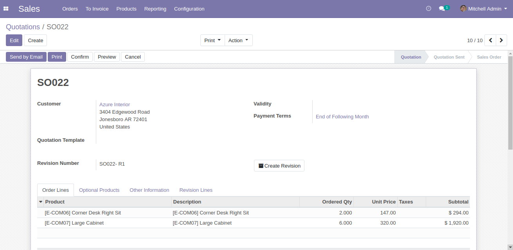
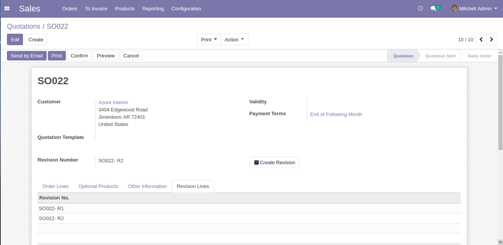
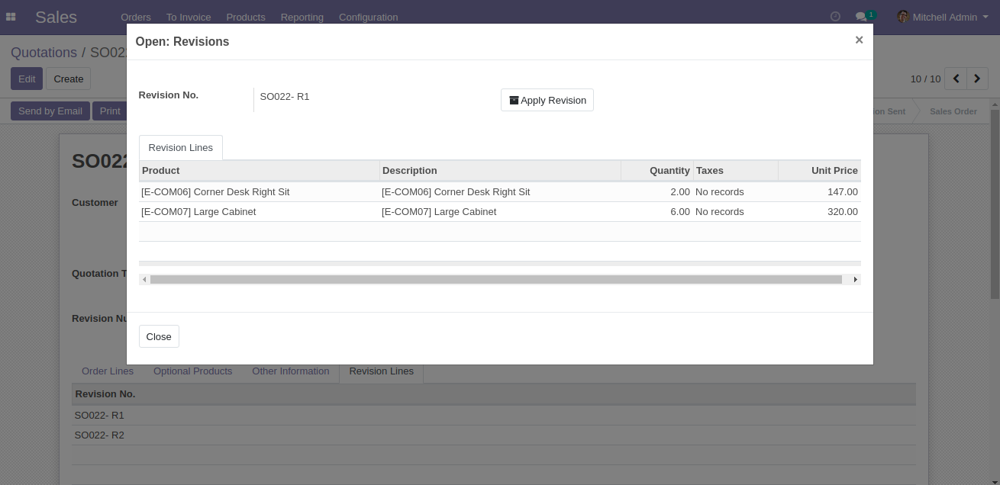

Author : FOSS INFOTECH PVT LTD

Module : sale\_revision

Version : 12

<h2>Sales Revision</h2>

This Application helps you capture the products in the sale order and stores them as revisions and you can roll back to any revision at anytime and apply them to your Sale Order.  

<b>Step 1</b>:

            <ul>
                <li>Create a draft Sale Order</li>
                <li>As you can see in the below image a button name 'Create Revision'. if you click on it, it captures products in the sale orders and creates a revision.</li>
            </ul>
        

<b>Step 2</b>:

            <ul>
                <li>Newly created revision will be displayed on the form.</li>
                <li>To see the history of revisions, Go to 'Revision Lines'</li>
                <li>If you want to see products and their quantities under each revision
                click on the revision</li>
            </ul>
        

<b>Step 3</b>:

            <ul>
                <li>On a wizard, it displays the products and their quantities.</li>
                <li>If you want to apply the revision to your sale order click on 'Apply Revision'</li>
            </ul>
        

<b>Step 4</b>:

            <ul>
                <li>The selected revision has been applied to the sale order.
                </li>
            </ul>
        

