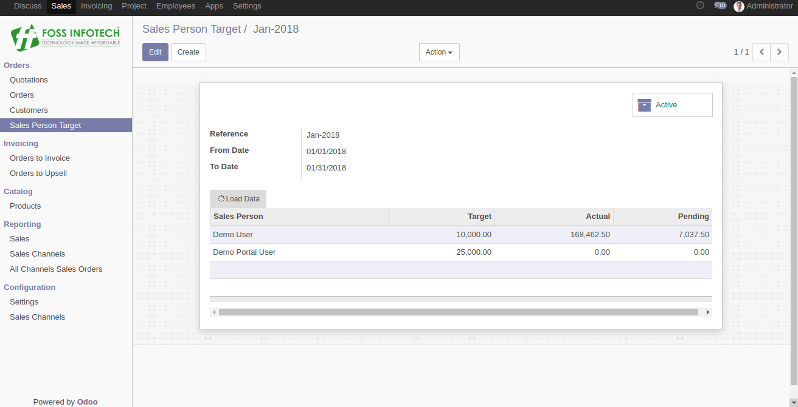

Author : FOSS INFOTECH PVT LTD

Module : sale\_target

Version : 11.0

<h2>Sales Team Target Management</h2>

This module helps in fixing a target to the sales team and also helps view the difference between the actual sales done and Planned target amount with a single click.

<b>Step 1</b>:Sales Team Target Management - Menu.

<b>Step 2</b>:Fix a Target to the Sales Person by tagging them in the line item.

<b>Step 3</b>:To view the actuals and the pending value, Click on "Load Data".

