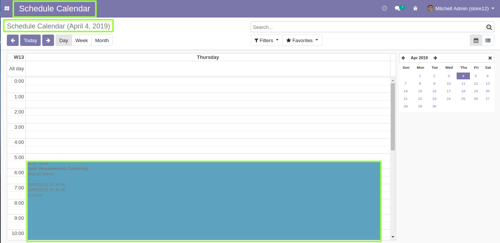

Author : FOSS INFOTECH PVT LTD

Module : foss\_schedule\_calendar

Version : 12

<h2>Schedule Calendar</h2>

You can Manage all your scheduled tasks and meetings in one place by installing this module.

<b>Step 1</b>: If you schedule a meeting in the calendar module, it'll reflect the same in schedule calendar.

<b>Step 2</b>: Reflection of the created meeting, both in form and calendar view.Clicking on 'View Record' will take you to the original record.

<b>Step 3</b>: The same action takes place if you create tasks.

<b>Step 4</b>:Reflection of the created task, both in form and calendar view.

