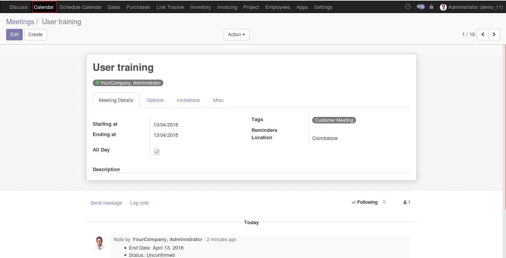
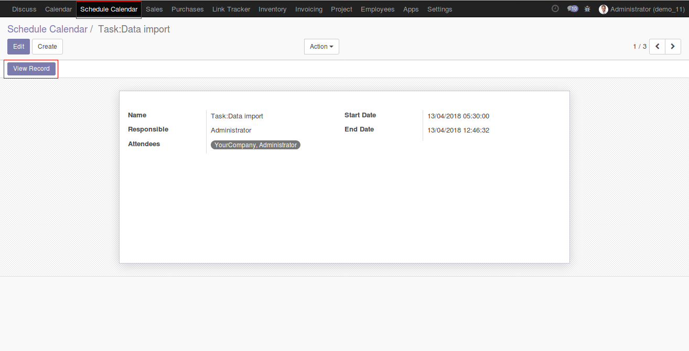

Author : FOSS INFOTECH PVT LTD

Module : foss\_schedule\_calendar

Version : 11

<h2>Schedule Calendar</h2>

Schedule Calendar module for Odoo 11. Using this module, You can create a scheduled event in the calendar and for any specific event.

<b>Step 1</b>: Install the module, Go to calendar menu and create an event.

<b>Step 2</b>: Or either create a task in the project menu.

<b>Step 3</b>: Now go to Schedule calendar, Find the Event and the Task that was created earlier which is now reflected in the schedule calendar.

<b>Step 4</b>:Go to schedule calendar, Click on 'View record'.

<b>Step 5</b>:Doing so, it will take you to the task you have created.

