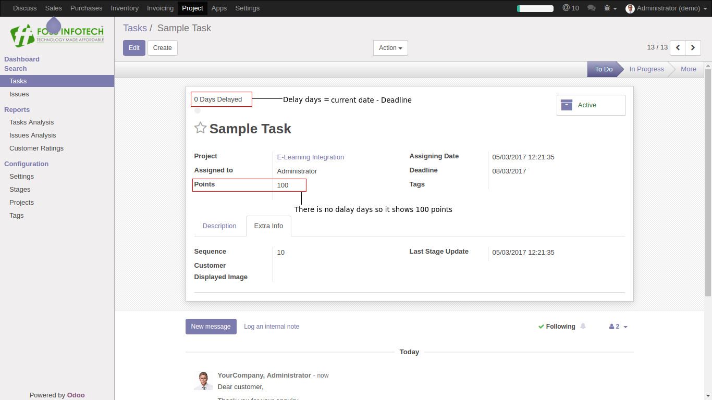
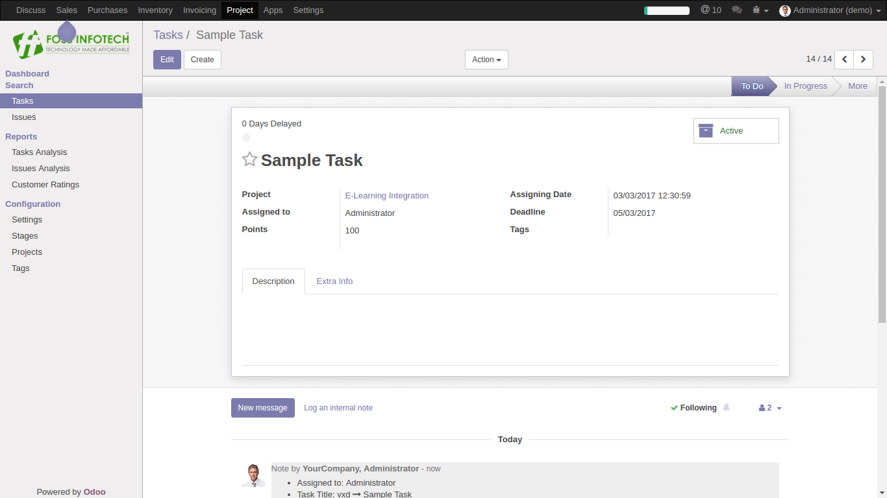
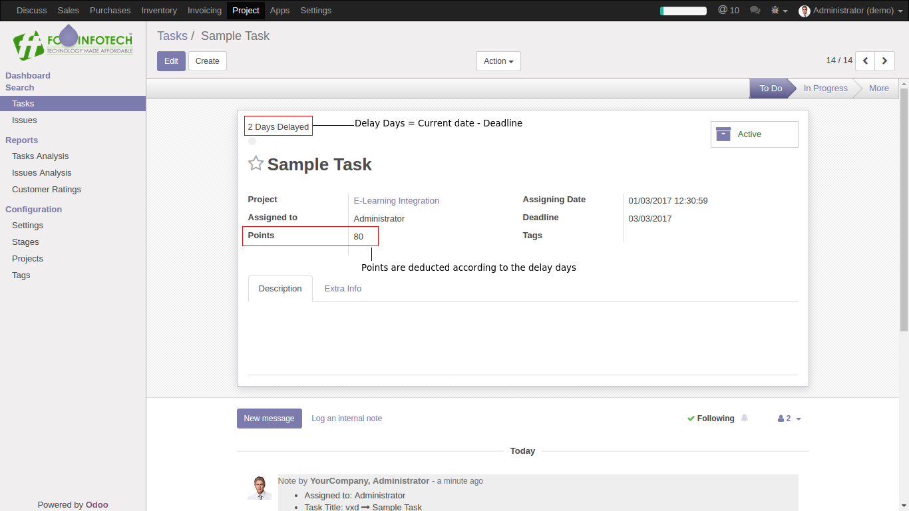

Author : FOSS INFOTECH PVT LTD

Module : foss\_task\_score\_card

Version : 11

<h2>Task Score Card</h2>

Task score card module for Odoo 11. This modules helps you add score for tasks based on their work progress.

<b>Step 1</b>:Choose the Assigning date and the Deadline to calculate the points.

<b>Step 2</b>:  Assigning date should not be higher than the Deadline date.

<b>Step 3</b>: Once you have assigned the Deadline it will automatically calculate the delay days and   the points according to the Deadline date.

