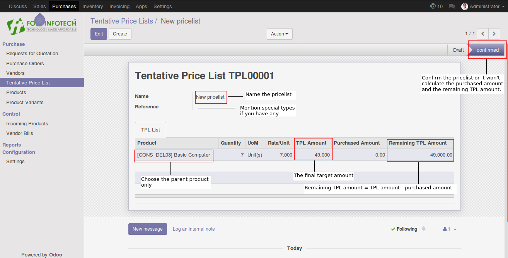
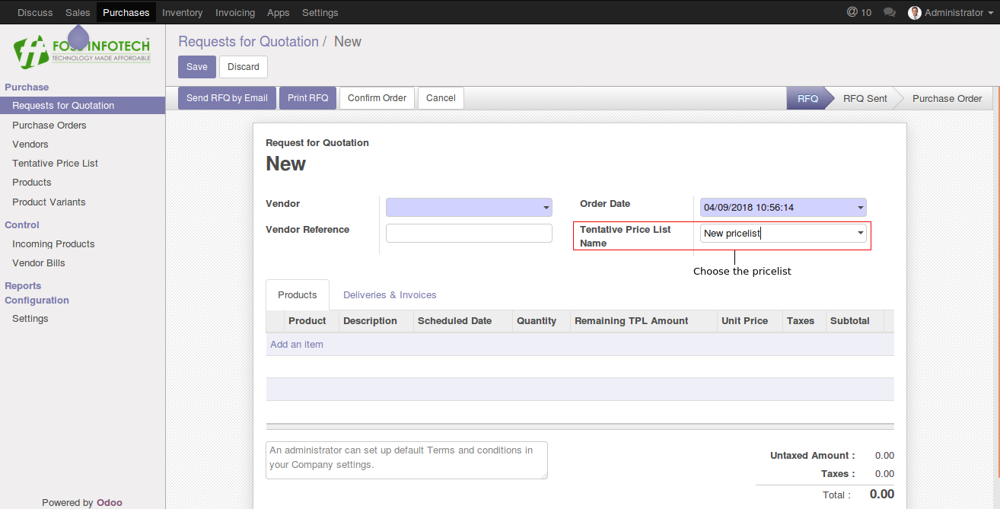
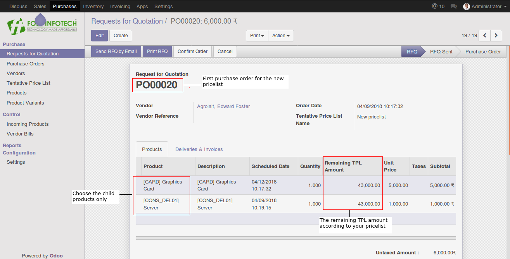
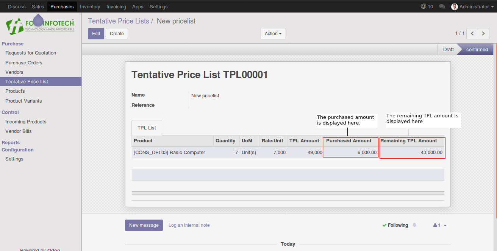

Author : FOSS INFOTECH PVT LTD

Module : foss\_tentative\_price\_list

Version : 11

<h2>Tentative Price list</h2>

Tenative price list module for Odoo 11. This modules helps you set a target amount for a set of products in purchase order.

<b>Step 1</b>: Go to Tentative price list and create your price list. Choose the parent parent and set the target amount.

<b>Step 2</b>: Create your quotation and choose the price list.

<b>Step 3</b>:Choose the respective child products. 

<b>Step 4</b>: Find the Remaining TPL amount and the purchased amount in Tentative price list as well. 

